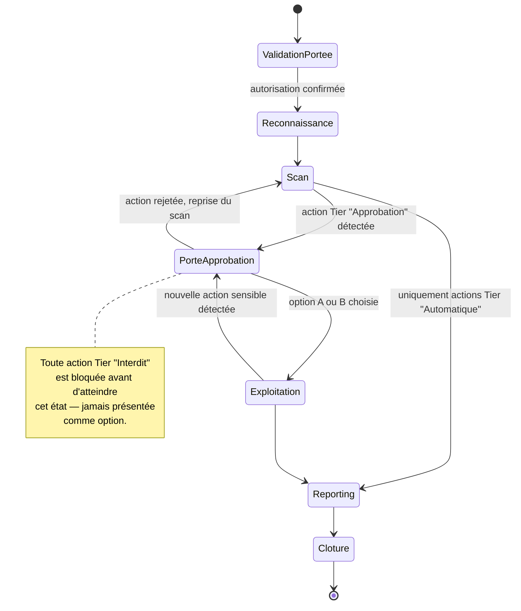

# Plan de Travail : Projet AegisPen
**Plateforme d'Orchestration Intelligente de Tests d'Intrusion Guidée par le Risque, pour Applications Web & Active Directory**

*Projet de Fin d'Études (PFE) / Capstone Project — Cybersécurité Offensive & Ingénierie Logicielle*

**Auteur :** Refa
**Date :** Juillet 2026
**Version du document :** 2.0 (Édition amplifiée)

---

## Sommaire

1. Résumé Exécutif & Problématique
2. Vision & Facteurs de Différenciation
3. Objectifs du Projet
4. Cadre Éthique, Légal & Périmètre (Scope)
5. Automation Stratifiée par le Risque (Tiers de Risque)
6. Architecture Système & Stack Technique
7. Sécurité de la Plateforme elle-même
8. Planning & Feuille de Route Détaillée (12 Semaines)
9. Gestion de Projet, Risques & Indicateurs de Succès
10. Livrables Attendus
11. Glossaire
12. Références & Bibliographie

---

## 1. Résumé Exécutif & Problématique

### 1.1 Présentation du Projet
**AegisPen** est une plateforme d'orchestration et d'automatisation des tests d'intrusion (pentest) ciblant les applications Web et les environnements Active Directory (AD). Son objectif principal est d'automatiser les tâches répétitives et à faible risque (reconnaissance, énumération, découverte initiale de vulnérabilités) tout en conservant une supervision humaine stricte (« *Human-in-the-Loop* ») pour toute action présentant un risque opérationnel. AegisPen ne cherche pas à remplacer le pentesteur, mais à le libérer des tâches mécaniques pour qu'il concentre son expertise sur l'analyse, la décision et l'exploitation contrôlée.

### 1.2 Problématique
* **Lenteur des tests manuels :** Une part significative d'un engagement de pentest (souvent estimée à 30-40 % du temps facturé) est consacrée à des tâches mécaniques et répétitives — scans de ports, énumération de sous-domaines, recherche de fichiers/répertoires, identification de comptes Kerberoastables — qui n'exigent pas de jugement expert mais absorbent un temps précieux.
* **Limites des outils d'IA totalement autonomes :** L'automatisation non supervisée présente de graves risques opérationnels (crashs de systèmes en production, altération irréversible de données, verrouillages de comptes en masse) et souffre d'un déficit de confiance structurel de la part des entreprises clientes et des RSSI, qui refusent souvent catégoriquement de laisser un agent agir sans contrôle.
* **Le vide entre ces deux extrêmes :** Il existe aujourd'hui peu d'outils qui formalisent explicitement *où* placer le curseur entre automatisation et supervision humaine, avec une méthode reproductible plutôt qu'une confiance aveugle envers un opérateur ou un algorithme.
* **Positionnement d'AegisPen :** Trouver le juste milieu en automatisant ce qui est sûr, mesurable et réversible, et en imposant une prise de décision humaine explicite — assortie de deux options motivées (conservatrice vs. agressive) — dès que le niveau de risque calculé dépasse un seuil défini.

---

## 2. Vision & Facteurs de Différenciation

### 2.1 Vision
Faire d'AegisPen une référence méthodologique autant qu'un outil : démontrer qu'il est possible de quantifier objectivement le risque d'une action offensive, et d'en faire un critère de décision auditable — plutôt qu'une intuition d'opérateur non tracée. À terme, la plateforme doit pouvoir servir de socle à des audits réels en environnement de laboratoire crédible, avec un niveau de rigueur et de traçabilité comparable aux exigences d'un livrable client professionnel.

### 2.2 Facteurs de Différenciation
| Axe | Approche AegisPen | Alternative usuelle |
| :--- | :--- | :--- |
| **Prise de décision** | Score de risque quantifié + choix binaire argumenté (conservateur / agressif) | Décision manuelle non tracée, ou automatisation « tout ou rien » |
| **Traçabilité** | Journal d'audit immuable (hash-chaining), preuve horodatée de chaque décision humaine | Logs applicatifs classiques, souvent altérables |
| **Portée** | Web **et** Active Directory dans un seul pipeline unifié | Outils spécialisés cloisonnés (Web *ou* AD, rarement les deux) |
| **Livrable final** | Rapport PDF client généré automatiquement à partir des preuves structurées en base | Rédaction manuelle du rapport, chronophage et sujette à erreurs |
| **Éthique intégrée** | Validation de portée obligatoire et blocage dur des actions Tier "Interdit" au niveau plateforme | Confiance reposant uniquement sur la discipline de l'opérateur |

---

## 3. Objectifs du Projet

1. **Automation de bout en bout (Recon/Énumération) :** Traiter les volets Web et Active Directory dans des environnements de laboratoire contrôlés, du premier scan jusqu'à la remise du rapport.
2. **Modèle quantitatif de scoring du risque :** Classifier automatiquement chaque action en trois catégories (*Automatique*, *Soumis à approbation*, *Interdit*) via une formule reproductible et justifiable.
3. **Workflow d'approbation à choix binaire :** Proposer au pentesteur deux options argumentées (Option A conservatrice, Option B agressive) lors des points de décision critiques, avec les conséquences attendues de chacune.
4. **Journalisation et Traçabilité (Audit Trail) :** Archiver l'intégralité des actions automatiques, des décisions humaines, des justifications et des preuves associées, de façon infalsifiable.
5. **Génération automatique de rapports PDF :** Produire un rapport d'audit professionnel prêt à être livré au client, directement à partir des données structurées en base.
6. **Packaging Portfolio & PFE :** Livrer un projet complet, documenté et prêt pour démonstration technique et soutenance, avec une posture éthique et légale exemplaire.

---

## 4. Cadre Éthique, Légal & Périmètre (Scope)

### 4.1 Règles d'Engagement Rigoureuses
* **Cibles autorisées uniquement :** Infrastructure propre ou laboratoires de vulnérabilités dédiés (GOAD/GOAD-Light, DVWA, OWASP Juice Shop, HackTheBox/TryHackMe sous conditions).
* **Isolation réseau :** Exécution au sein d'un réseau hôte uniquement ou réseau Docker/VirtualBox privé isolé (aucun pont direct sur le réseau domestique ou internet).
* **Étape de validation de portée intégrée :** Obligation de valider explicitement le périmètre et l'autorisation avant tout lancement d'exécution — cette étape est elle-même un état bloquant de la machine à états (voir §6.3).

### 4.2 Périmètre Applicatif
* **En périmètre :** Applications Web et environnements Active Directory en lab.
* **Hors périmètre :** Attaques Cloud, ingénierie sociale, attaques physiques, ou toute action sur un système non autorisé.

---

## 5. Automation Stratifiée par le Risque (Tiers de Risque)

### 5.1 Vue d'Ensemble des Tiers

| Niveau (Tier) | Définition | Acteur | Exemples d'actions |
| :--- | :--- | :--- | :--- |
| **Automatique** | Lecture seule, actions réversibles, faible impact et faible bruit. | Plateforme (sans confirmation) | Scan de ports (Nmap), énumération DNS/LDAP anonyme, analyse de headers, inspection `robots.txt`. |
| **Soumis à approbation** | Modification d'état potentielle, trafic important, extraction de données sensibles. | Pentesteur (Choix entre 2 options) | Scans actifs (ZAP, Nuclei avancé), confirmation SQLi/XSS, extraction de hashes Kerberoast/AS-REP. |
| **Interdit** | Action destructive, irréversible ou hors périmètre éthique. | Bloqué par la plateforme | Chiffrement type Ransomware, brute-force massif provoquant un verrouillage de compte, DCSync non autorisé. |

### 5.2 Formule de Scoring du Risque

Chaque action candidate est notée sur trois axes, chacun évalué sur une échelle de 1 (faible) à 5 (élevé) :

```
Score = Impact × Détectabilité / Réversibilité
```

* **Impact** : gravité potentielle si l'action produit un effet indésirable (perte de service, altération de données, verrouillage de compte).
* **Détectabilité** : probabilité que l'action génère du bruit ou déclenche une alerte côté cible (1 = furtif, 5 = très bruyant).
* **Réversibilité** : facilité de revenir à l'état initial après exécution (1 = irréversible, 5 = totalement réversible).

**Seuils de bascule** (indicatifs, calibrables durant le sprint Moteur de Risque) :

| Score | Tier résultant |
| :--- | :--- |
| Score ≤ 2 | Automatique |
| 2 < Score ≤ 8 | Soumis à approbation |
| Score > 8 ou drapeau "irréversible" (Réversibilité = 1) | Interdit |

### 5.3 Exemples Chiffrés

| Action | Impact | Détectabilité | Réversibilité | Score | Tier |
| :--- | :---: | :---: | :---: | :---: | :--- |
| Scan Nmap SYN furtif | 1 | 2 | 5 | 0.4 | Automatique |
| Énumération LDAP anonyme | 1 | 1 | 5 | 0.2 | Automatique |
| Scan actif sqlmap (niveau agressif) | 3 | 4 | 4 | 3.0 | Soumis à approbation |
| Extraction de hashes Kerberoasting | 3 | 2 | 5 | 1.2* | Soumis à approbation (forcé par nature sensible des données) |
| Brute-force massif de comptes AD | 4 | 5 | 2 | 10.0 | Interdit |
| DCSync non autorisé | 5 | 1 | 1 | 5.0** | Interdit (drapeau irréversibilité) |

*Certaines actions à score numérique bas mais à sensibilité intrinsèque élevée (ex. extraction de secrets) sont surclassées manuellement via une liste de règles impératives (`hard_rules`) qui priment sur le calcul brut — documenté dans le Moteur de Risque.
**Le drapeau "Réversibilité = 1" force le classement en Interdit indépendamment du score, conformément à la règle de garde-fou du §5.2.

---

## 6. Architecture Système & Stack Technique

### 6.1 Architecture Globale
La plateforme repose sur un modèle d'orchestrateur composé de :
* **Tableau de bord Web (React) :** Visualisation en direct de l'engagement, affichage du fil d'actualité des découvertes et interface d'approbation.
* **API Orchestrateur (FastAPI) :** Gestion de la machine à états de l'engagement (Validation de portée → Recon → Scan → Porte d'Approbation → Exploitation → Rapport).
* **Moteur de Risque (Risk Engine) :** Calcul du score de risque d'une action selon la formule du §5.2.
* **Porte d'Approbation (Approval Gate) :** Mettre en pause l'exécution et présenter l'Option A (Conservatrice) et l'Option B (Agressive), avec conséquences attendues de chacune.
* **File de Tâches (Celery + Redis) :** Exécution asynchrone des outils de sécurité, sans bloquer l'API.
* **Couche d'Adaptateurs d'Outils (Tool Adapters) :** Normalisation des entrées/sorties des outils CLI sous un schéma JSON commun (§6.4).
* **Base de Données (PostgreSQL) :** Stockage des preuves, des vulnérabilités, et du journal d'audit complet.
* **Moteur de Rapport (Reporting Engine) :** Génération du rapport final au format PDF via WeasyPrint ou Pandoc.

### 6.2 Stack Technique

| Composant | Technologie Choisie | Rationale / Justification |
| :--- | :--- | :--- |
| **Backend API** | Python / FastAPI | Performance asynchrone, typage, intégration naturelle avec l'écosystème cyber. |
| **Orchestration / File** | Celery + Redis | Gestion robuste des tâches longues sans bloquer l'API. |
| **Frontend** | React + TypeScript + Tailwind | Interface réactive, claire et moderne. |
| **Base de Données** | PostgreSQL | Structuration relationnelle solide + support JSONB pour logs bruts. |
| **Outils Web** | Nmap, ffuf, Nuclei, sqlmap, OWASP ZAP | Standard de l'industrie, scriptables. |
| **Outils AD** | NetExec (nxc), BloodHound CE, Impacket | Références modernes pour les audits Active Directory. |
| **Laboratoire** | GOAD-Light, OWASP Juice Shop, Docker | Environnements vulnérables réalistes et reproductibles. |
| **Rapports** | WeasyPrint / HTML to PDF | Mise en page professionnelle et personnalisable. |

### 6.3 Machine à États de l'Engagement



### 6.4 Schéma JSON des Adaptateurs d'Outils

Chaque adaptateur (Nmap, ffuf, sqlmap, NetExec, BloodHound…) normalise ses entrées et sorties selon un contrat commun, indépendant de l'outil sous-jacent :

**Entrée standard :**
```json
{
  "tool": "nmap",
  "target": "10.10.10.5",
  "params": { "profile": "syn-stealth", "ports": "1-1024" },
  "risk_tier": "automatique",
  "engagement_id": "uuid"
}
```

**Sortie standard :**
```json
{
  "status": "success",
  "tool": "nmap",
  "raw_output_ref": "s3://evidence/engagement-uuid/nmap-01.xml",
  "parsed_findings": [
    { "type": "open_port", "port": 445, "service": "smb", "confidence": "high" }
  ],
  "evidence": [ "s3://evidence/engagement-uuid/nmap-01.xml" ],
  "timestamps": { "started_at": "2026-08-03T10:00:00Z", "finished_at": "2026-08-03T10:02:15Z" }
}
```

### 6.5 Modèle de Données (PostgreSQL)

Tables principales (schéma simplifié, à affiner durant le sprint Dashboard/API) :

* `engagements(id, name, scope_validated, status, created_at)`
* `targets(id, engagement_id, host, type)`
* `actions(id, engagement_id, tool, params, risk_score, tier, status)`
* `approvals(id, action_id, option_chosen, justification, approved_by, approved_at)`
* `evidence(id, action_id, storage_ref, type)`
* `findings(id, action_id, type, severity, description)`
* `audit_log(id, actor, event_type, payload, prev_hash, hash, created_at)` — chaînage de hachage pour garantir l'immuabilité (voir §7.3)
* `reports(id, engagement_id, pdf_ref, generated_at)`

### 6.6 Spécification API REST (extrait)

| Ressource | Endpoint | Méthode | Rôle |
| :--- | :--- | :--- | :--- |
| Engagements | `/engagements` | `POST` | Créer un engagement, exige `scope_validated=true` |
| Engagements | `/engagements/{id}` | `GET` | Consulter l'état courant (machine à états) |
| Actions | `/actions` | `POST` | Soumettre une action au Moteur de Risque |
| Actions | `/actions/{id}` | `GET` | Résultat + score + tier d'une action |
| Approbations | `/approvals/{action_id}` | `POST` | Choisir Option A / B avec justification |
| Findings | `/findings?engagement_id=` | `GET` | Lister les vulnérabilités découvertes |
| Rapports | `/reports/{engagement_id}` | `POST` | Générer le rapport PDF final |
| Auth | `/auth/login` | `POST` | Authentification JWT |

---

## 7. Sécurité de la Plateforme elle-même

Une plateforme qui automatise des actions offensives doit elle-même respecter un niveau d'exigence de sécurité au moins équivalent à celui qu'elle audite.

### 7.1 Authentification & Autorisation
* Authentification API par JWT à durée de vie courte + refresh token.
* Modèle RBAC minimal : rôle **Pentesteur** (peut approuver des actions, lancer des scans) vs rôle **Lecteur/Client** (accès en lecture seule aux rapports et au fil d'audit).

### 7.2 Gestion des Secrets & Credentials des Outils
* Aucun secret (identifiants AD, clés API) stocké en clair en base ni écrit dans les logs applicatifs.
* Variables d'environnement injectées au runtime des conteneurs, ou solution de coffre-fort (Vault / equivalent léger) pour les credentials utilisés par les adaptateurs NetExec/Impacket.

### 7.3 Intégrité du Journal d'Audit
* Table `audit_log` en append-only, chaque entrée contenant le hash de l'entrée précédente (`prev_hash`) — toute altération rétroactive casse la chaîne et devient détectable, condition nécessaire pour qu'un rapport d'audit soit crédible face à un client.
* Horodatage systématique de chaque décision humaine (option choisie, justification, identité de l'approbateur).

### 7.4 Durcissement du Déploiement
* Conteneurs Docker exécutés en utilisateur non-root.
* Réseau Docker dédié et isolé pour le lab cible, distinct du réseau applicatif d'AegisPen.
* Aucun secret injecté dans les images Docker (uniquement au runtime).
* Principe du moindre privilège appliqué aux conteneurs exécutant les outils offensifs (capacités Linux restreintes, pas d'accès réseau hôte direct).

---

## 8. Planning & Feuille de Route Détaillée (12 Semaines)

Pour chaque phase : objectif, tâches clés, critère d'acceptation mesurable, jalon de démonstration.

### Phase 0 — Fondations & Lab Setup (S01–S02)
* **Objectif :** Disposer d'un laboratoire isolé, reproductible et documenté.
* **Tâches :** Configuration VirtualBox/Docker ; déploiement GOAD-Light et OWASP Juice Shop ; isolation réseau ; vérification des accès.
* **Critère d'acceptation :** Le lab est joignable uniquement depuis le réseau isolé ; capture d'écran/preuve d'absence de route vers l'extérieur.
* **Jalon démo :** Scan Nmap manuel réussi contre une cible du lab, depuis l'environnement isolé.

### Phase 1 — MVP Automation Reconnaissance (S03–S04)
* **Objectif :** Premiers wrappers d'outils produisant une sortie normalisée.
* **Tâches :** Wrappers Python pour Nmap, ffuf, Nuclei ; normalisation des résultats au schéma JSON commun (§6.4) ; tests unitaires des parseurs.
* **Critère d'acceptation :** Trois outils différents produisent une sortie conforme au schéma commun, validée par un test automatisé.
* **Jalon démo :** Exécution en ligne de commande d'un scan de recon complet sur Juice Shop, sortie JSON affichée.

### Phase 2 — Dashboard v1 & API FastAPI (S05)
* **Objectif :** Rendre les résultats de recon consultables via une interface web.
* **Tâches :** API REST de base (`/engagements`, `/actions`) ; interface React affichant le fil de découvertes.
* **Critère d'acceptation :** Un engagement créé via l'API est visible et actualisé en direct dans le dashboard.
* **Jalon démo :** Lancement d'un scan depuis l'UI, résultats affichés sans rechargement manuel.

### Phase 3 — Moteur de Risque & Workflow d'Approbation (S06–S07)
* **Objectif :** Implémenter la classification par tier et la porte d'approbation.
* **Tâches :** Algorithme de scoring (§5.2) ; machine à états (Pause/Reprise) ; UI de choix entre Option A et Option B.
* **Critère d'acceptation :** Les six exemples chiffrés du §5.3 sont correctement classifiés par le moteur, validés par tests.
* **Jalon démo :** Une action Tier "Approbation" met l'engagement en pause et affiche les deux options argumentées dans l'UI.

### Phase 4 — Module Active Directory (S08)
* **Objectif :** Étendre l'automatisation au périmètre AD.
* **Tâches :** Intégration NetExec + BloodHound CE ; détection Kerberoasting / AS-REP Roasting.
* **Critère d'acceptation :** Détection réussie d'au moins un compte Kerberoastable sur GOAD-Light, avec preuve capturée en base.
* **Jalon démo :** Chemin d'attaque BloodHound visualisé dans le dashboard après une campagne d'énumération AD.

### Phase 5 — Module Web Approfondi (S09)
* **Objectif :** Couvrir les scans actifs et l'exploitation guidée côté Web.
* **Tâches :** Intégration sqlmap & OWASP ZAP sous porte d'approbation ; scénario d'exploitation guidée sur Juice Shop.
* **Critère d'acceptation :** Une injection SQL confirmée sur Juice Shop déclenche la porte d'approbation avant toute extraction de données.
* **Jalon démo :** Scénario complet recon → détection SQLi → approbation → extraction contrôlée, journalisé de bout en bout.

### Phase 6 — Moteur de Reporting (S10)
* **Objectif :** Générer un rapport client à partir des données structurées.
* **Tâches :** Modèle de rapport PDF ; export automatique depuis PostgreSQL (findings, preuves, décisions).
* **Critère d'acceptation :** Un rapport PDF généré en un clic contient toutes les findings d'un engagement, avec preuves et journal de décisions.
* **Jalon démo :** Génération live d'un rapport PDF à partir d'un engagement complété en Phase 5.

### Phase 7 — Polissage & Packaging Portfolio (S11–S12)
* **Objectif :** Livrer un projet présentable et soutenable.
* **Tâches :** Docker Compose global ; README détaillé ; enregistrement d'une démo vidéo ; préparation de la soutenance.
* **Critère d'acceptation :** `docker compose up` déploie l'ensemble de la plateforme depuis un environnement propre, sans étape manuelle non documentée.
* **Jalon démo :** Démonstration de bout en bout filmée : validation de portée → recon → approbation → exploitation → rapport PDF.

---

## 9. Gestion de Projet, Risques & Indicateurs de Succès

### 9.1 Registre des Risques Projet

| Risque | Probabilité | Impact | Mitigation |
| :--- | :---: | :---: | :--- |
| Dérive de scope (feature creep) | Moyenne | Élevé | S'en tenir strictement aux 7 phases définies ; toute idée nouvelle passe en backlog "post-PFE". |
| Complexité sous-estimée du Moteur de Risque | Moyenne | Moyen | Prototyper la formule de scoring dès S06 avec les cas du §5.3 avant intégration UI. |
| Indisponibilité/instabilité du lab GOAD | Faible | Élevé | Snapshots VM réguliers ; documentation de restauration rapide. |
| Retard d'intégration BloodHound/NetExec | Moyenne | Moyen | Réserver un buffer d'une semaine avant la Phase 5 ; tester l'intégration en isolation dès S07. |
| Rapport PDF trop générique pour être crédible | Faible | Moyen | Valider le template de rapport avec un exemple réel dès Phase 6, itérer avant polissage final. |

### 9.2 Indicateurs de Succès (KPIs)

* **Précision de classification :** ≥ 95 % des actions de test correctement classées dans le bon tier par le Moteur de Risque.
* **Gain de temps recon :** Temps de reconnaissance automatisée mesuré vs. estimation manuelle équivalente (objectif indicatif : réduction ≥ 50 %).
* **Complétude d'engagement :** Taux d'engagements de démonstration menés de bout en bout (validation de portée → rapport) sans intervention hors workflow prévu.
* **Intégrité de l'audit :** 100 % des décisions d'approbation tracées avec justification, horodatage et chaînage de hash valide.

### 9.3 Critères d'Évaluation pour la Soutenance
* **Démonstration live** d'un engagement complet sur le lab (Web + AD).
* **Qualité du code** : structure, tests, documentation technique.
* **Rigueur de la traçabilité** : capacité à présenter le journal d'audit d'un engagement précis à la demande du jury.
* **Posture éthique et légale** : clarté du cadre de scope, justification du positionnement Human-in-the-Loop.

---

## 10. Livrables Attendus

1. **Code Source Complet :** Dépôt GitHub structuré avec backend FastAPI, frontend React, adaptateurs d'outils et scripts Docker.
2. **Plateforme Fonctionnelle :** Démonstration d'un audit complet sur lab (GOAD + Juice Shop) avec interceptions d'approbation.
3. **Rapport Audit PDF Généré :** Exemple de rapport client issu directement d'une campagne de test.
4. **Documentation & Article Technique :** README détaillé, vidéo de démonstration et publication LinkedIn axée sur la gestion du risque et le contrôle humain.

---

## 11. Glossaire

| Terme | Définition |
| :--- | :--- |
| **Kerberoasting** | Technique consistant à demander des tickets de service Kerberos pour des comptes de service AD, puis à tenter de casser leur hash hors ligne pour en extraire le mot de passe. |
| **AS-REP Roasting** | Attaque exploitant les comptes AD dont la pré-authentification Kerberos est désactivée, permettant d'obtenir un hash crackable sans identifiants valides. |
| **DCSync** | Technique abusant des permissions de réplication AD pour extraire des hashes de mots de passe directement depuis un contrôleur de domaine, sans y exécuter de code. |
| **Human-in-the-Loop** | Modèle où une décision automatisée est systématiquement soumise à validation humaine avant exécution, dès lors qu'un seuil de risque est atteint. |
| **Tier de risque** | Catégorie (Automatique / Approbation / Interdit) attribuée à une action selon son score de risque calculé. |
| **Porte d'Approbation** | Composant logiciel qui interrompt l'exécution automatique et présente deux options argumentées au pentesteur. |
| **GOAD** | *Game Of Active Directory* — laboratoire Active Directory vulnérable, conçu pour l'entraînement et les tests de sécurité. |

---

## 12. Références & Bibliographie

* **MITRE ATT&CK** — Base de connaissance des tactiques et techniques d'attaque, utilisée pour cadrer les scénarios Web et AD.
* **OWASP Testing Guide** — Méthodologie de référence pour les tests d'intrusion applicatifs Web.
* **NIST SP 800-115** — *Technical Guide to Information Security Testing and Assessment*, cadre méthodologique pour la conduite d'un pentest.
* **Documentation GOAD / GOAD-Light** — Spécifications et scénarios du laboratoire Active Directory utilisé.
* **Documentation officielle des outils intégrés** — Nmap, ffuf, Nuclei, sqlmap, OWASP ZAP, NetExec, BloodHound CE, Impacket.
